# Tree Diagram — The Daily Reflection Tree

## Full Branching Structure (Mermaid)

```mermaid
flowchart TD
    START([START\nOpening]) --> A1_OPEN

    subgraph AXIS1 ["AXIS 1 — Locus of Control"]
        A1_OPEN[A1_OPEN\nOne word for today?]
        A1_D1{A1_D1\nRoute by word}
        A1_Q_HIGH[A1_Q_HIGH\nWhat made it go well?]
        A1_Q_LOW[A1_Q_LOW\nFirst instinct when hard?]
        A1_D2_HIGH{A1_D2_HIGH}
        A1_D2_LOW{A1_D2_LOW}
        A1_R_INT(A1_R_INT\nInternal reflection)
        A1_R_EXT_MILD(A1_R_EXT_MILD\nMild external reflection)
        A1_R_EXT(A1_R_EXT\nExternal reflection)
        A1_Q2[A1_Q2\nMoment things didn't go as planned?]
        A1_D3{A1_D3}
        A1_R2_INT(A1_R2_INT\nInternal #2)
        A1_R2_EXT(A1_R2_EXT\nExternal #2)
    end

    BRIDGE_1_2[/BRIDGE_1_2\nAxis 1→2 transition/]

    subgraph AXIS2 ["AXIS 2 — Contribution vs Entitlement"]
        A2_OPEN[A2_OPEN\nSignificant interaction today?]
        A2_D1{A2_D1\nRoute by orientation}
        A2_Q_CONTRIB[A2_Q_CONTRIB\nWhat drove your help?]
        A2_Q_ENTITLE[A2_Q_ENTITLE\nHow did you respond to being unseen?]
        A2_D2_CONTRIB{A2_D2_CONTRIB}
        A2_D2_ENTITLE{A2_D2_ENTITLE}
        A2_R_CONTRIB_PURE(A2_R_CONTRIB_PURE\nPure contribution)
        A2_R_CONTRIB_MIXED(A2_R_CONTRIB_MIXED\nMixed contribution)
        A2_R_ENTITLE_AWARE(A2_R_ENTITLE_AWARE\nEntitlement, self-aware)
        A2_R_ENTITLE(A2_R_ENTITLE\nEntitlement reflection)
        A2_Q2[A2_Q2\nEnergy you brought today?]
        A2_D3{A2_D3}
        A2_R2_CONTRIB(A2_R2_CONTRIB\nContrib #2)
        A2_R2_ENTITLE(A2_R2_ENTITLE\nEntitle #2)
    end

    BRIDGE_2_3[/BRIDGE_2_3\nAxis 2→3 transition/]

    subgraph AXIS3 ["AXIS 3 — Radius of Concern"]
        A3_OPEN[A3_OPEN\nWhose presence comes up most?]
        A3_D1{A3_D1\nRoute by focus}
        A3_Q_SELF[A3_Q_SELF\nDid anyone break through?]
        A3_Q_OTHER[A3_Q_OTHER\nWhat did you do with that awareness?]
        A3_D2_SELF{A3_D2_SELF}
        A3_D2_OTHER{A3_D2_OTHER}
        A3_R_SELF(A3_R_SELF\nSelf reflection)
        A3_R_TRANS(A3_R_TRANS\nTranscendence reflection)
        A3_R_OTHER(A3_R_OTHER\nOther-aware reflection)
        A3_R_AWARE(A3_R_AWARE\nNear-miss reflection)
        A3_Q2[A3_Q2\nHow others would describe your presence?]
        A3_D3{A3_D3}
        A3_R2_OTHER(A3_R2_OTHER\nAltrocentric #2)
        A3_R2_SELF(A3_R2_SELF\nSelf #2)
    end

    BRIDGE_3_END[/BRIDGE_3_END\nClosing transition/]
    SUMMARY[[SUMMARY\nPersonalised reflection summary]]
    END([END\nClosing])

    %% Axis 1 flow
    A1_OPEN --> A1_D1
    A1_D1 -->|Productive / Surprising| A1_Q_HIGH
    A1_D1 -->|Tough / Frustrating / Mixed| A1_Q_LOW
    A1_Q_HIGH --> A1_D2_HIGH
    A1_Q_LOW --> A1_D2_LOW
    A1_D2_HIGH -->|Prepared / Adapted| A1_R_INT
    A1_D2_HIGH -->|Team / Luck| A1_R_EXT_MILD
    A1_D2_LOW -->|Figured out / Pushed through| A1_R_INT
    A1_D2_LOW -->|Waited / Stuck| A1_R_EXT
    A1_R_INT --> A1_Q2
    A1_R_EXT_MILD --> A1_Q2
    A1_R_EXT --> A1_Q2
    A1_Q2 --> A1_D3
    A1_D3 -->|Looked / Tried different| A1_R2_INT
    A1_D3 -->|Wished / Blamed| A1_R2_EXT
    A1_R2_INT --> BRIDGE_1_2
    A1_R2_EXT --> BRIDGE_1_2

    %% Axis 2 flow
    BRIDGE_1_2 --> A2_OPEN
    A2_OPEN --> A2_D1
    A2_D1 -->|Helped / Beyond asked| A2_Q_CONTRIB
    A2_D1 -->|Expected same / Not noticed| A2_Q_ENTITLE
    A2_Q_CONTRIB --> A2_D2_CONTRIB
    A2_Q_ENTITLE --> A2_D2_ENTITLE
    A2_D2_CONTRIB -->|Wanted success / Right thing| A2_R_CONTRIB_PURE
    A2_D2_CONTRIB -->|Expected return / Felt useful| A2_R_CONTRIB_MIXED
    A2_D2_ENTITLE -->|Raised it / Bigger picture| A2_R_ENTITLE_AWARE
    A2_D2_ENTITLE -->|Pulled back / Resentment| A2_R_ENTITLE
    A2_R_CONTRIB_PURE --> A2_Q2
    A2_R_CONTRIB_MIXED --> A2_Q2
    A2_R_ENTITLE_AWARE --> A2_Q2
    A2_R_ENTITLE --> A2_Q2
    A2_Q2 --> A2_D3
    A2_D3 -->|Gave more / Looked for ways| A2_R2_CONTRIB
    A2_D3 -->|Own work / Survival| A2_R2_ENTITLE
    A2_R2_CONTRIB --> BRIDGE_2_3
    A2_R2_ENTITLE --> BRIDGE_2_3

    %% Axis 3 flow
    BRIDGE_2_3 --> A3_OPEN
    A3_OPEN --> A3_D1
    A3_D1 -->|Mostly me| A3_Q_SELF
    A3_D1 -->|Team / Colleague / Mission| A3_Q_OTHER
    A3_Q_SELF --> A3_D2_SELF
    A3_Q_OTHER --> A3_D2_OTHER
    A3_D2_SELF -->|Acted on it| A3_R_TRANS
    A3_D2_SELF -->|Noticed / Didn't / Overwhelmed| A3_R_SELF
    A3_D2_OTHER -->|Acted / Checked in / Shaped work| A3_R_OTHER
    A3_D2_OTHER -->|Held in mind| A3_R_AWARE
    A3_R_SELF --> A3_Q2
    A3_R_TRANS --> A3_Q2
    A3_R_OTHER --> A3_Q2
    A3_R_AWARE --> A3_Q2
    A3_Q2 --> A3_D3
    A3_D3 -->|Fully present / Looking out| A3_R2_OTHER
    A3_D3 -->|Own track / Distant| A3_R2_SELF
    A3_R2_OTHER --> BRIDGE_3_END
    A3_R2_SELF --> BRIDGE_3_END

    %% Closing
    BRIDGE_3_END --> SUMMARY
    SUMMARY --> END

    %% Styling
    classDef question fill:#1a3a5c,stroke:#4a90d9,color:#e8f4fd
    classDef decision fill:#3d2b00,stroke:#f0a500,color:#fff8e7
    classDef reflection fill:#1a3d1a,stroke:#4caf50,color:#e8f5e9
    classDef bridge fill:#2d1a3d,stroke:#9c27b0,color:#f3e5f5
    classDef summary fill:#1a1a3d,stroke:#3f51b5,color:#e8eaf6
    classDef terminal fill:#1a1a1a,stroke:#888,color:#ccc

    class A1_OPEN,A1_Q_HIGH,A1_Q_LOW,A1_Q2,A2_OPEN,A2_Q_CONTRIB,A2_Q_ENTITLE,A2_Q2,A3_OPEN,A3_Q_SELF,A3_Q_OTHER,A3_Q2 question
    class A1_D1,A1_D2_HIGH,A1_D2_LOW,A1_D3,A2_D1,A2_D2_CONTRIB,A2_D2_ENTITLE,A2_D3,A3_D1,A3_D2_SELF,A3_D2_OTHER,A3_D3 decision
    class A1_R_INT,A1_R_EXT_MILD,A1_R_EXT,A1_R2_INT,A1_R2_EXT,A2_R_CONTRIB_PURE,A2_R_CONTRIB_MIXED,A2_R_ENTITLE_AWARE,A2_R_ENTITLE,A2_R2_CONTRIB,A2_R2_ENTITLE,A3_R_SELF,A3_R_TRANS,A3_R_OTHER,A3_R_AWARE,A3_R2_OTHER,A3_R2_SELF reflection
    class BRIDGE_1_2,BRIDGE_2_3,BRIDGE_3_END bridge
    class SUMMARY summary
    class START,END terminal
```

---

## Node Count Summary

| Type | Count |
|------|-------|
| start | 1 |
| question | 12 |
| decision | 12 |
| reflection | 17 |
| bridge | 3 |
| summary | 1 |
| end | 1 |
| **Total** | **47** |

## Possible Paths

The tree supports **2³ = 8** distinct summary outcomes (3 binary axes × 2 poles each), with multiple sub-paths per axis leading to the same outcome — giving a total of approximately **32 unique full traversals** depending on intermediate question answers.
